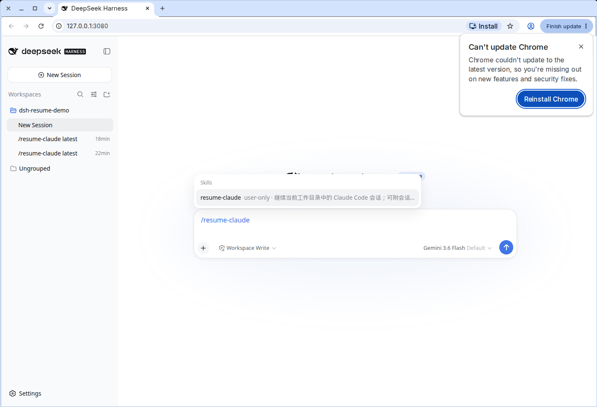
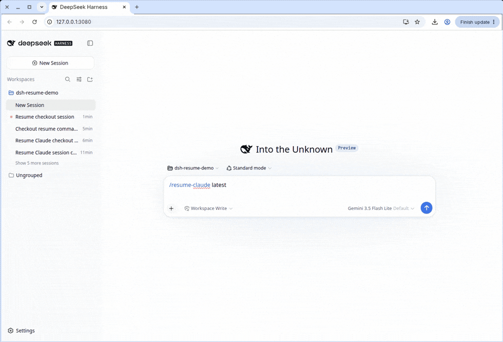
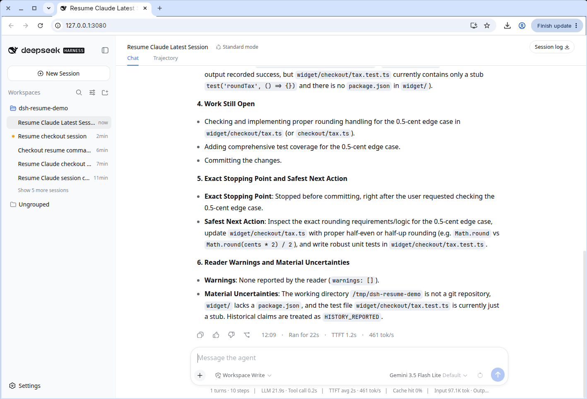
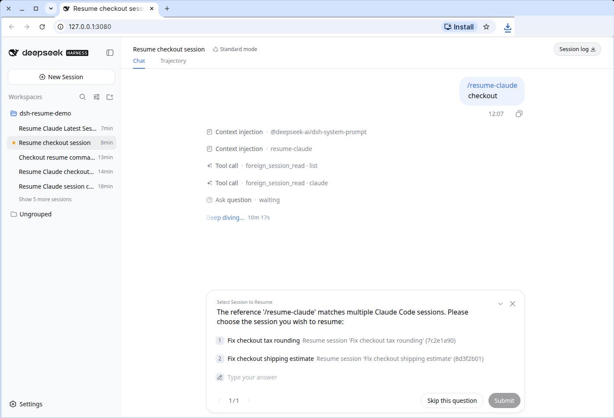

# dsh-resume

[中文](README.md)

Continue unfinished Codex, Claude Code, Cursor, Grok, or Pi work inside DeepSeek Harness.

Type `/resume-claude`, or the matching command for the other four. The plugin reads that local session, pulls context that can still be handed off, and writes a card into the current DSH chat. It does not restart the old process or rewrite anyone else's session files.









The six sections are objective, files, done, remaining, stopped at, and reader warnings. If a title is ambiguous it lists candidates instead of guessing.

## Install

DeepSeek Harness `0.1.2-rc.1`, Node.js `22.19+` or `24+`, Python 3. `zstd` is only needed for compressed Codex rollouts.

```sh
dsh plugin --profile web add github:aa2246740/dsh-resume
```

Or from a clone:

```sh
git clone https://github.com/aa2246740/dsh-resume.git
dsh plugin --profile web add ./dsh-resume
```

Then restart that DSH Host. There is no client bundle, so a browser reload is usually unnecessary. Confirm the slash commands appeared. Do not mount it through both a bundle and a patch.

```sh
dsh plugin --profile web remove dsh-resume
```

## Commands

Read-only. Foreign session stores are not modified. System prompts, hidden reasoning, encrypted or corrupt records are dropped or marked unavailable. History conclusions start as `HISTORY_REPORTED`. Only facts checked in the current workspace this turn are `CURRENT_OBSERVED`. Grok reads visible `updates.jsonl` only. Pi follows the current branch only.

| Command | Source |
| --- | --- |
| `/resume-codex [latest \| session id \| path \| title]` | Codex CLI / app |
| `/resume-claude [latest \| session id \| path \| title]` | Claude Code |
| `/resume-cursor [latest \| session id \| path \| title]` | Cursor |
| `/resume-grok [latest \| session id \| path \| title]` | Grok |
| `/resume-pi [latest \| session id \| path \| title]` | Pi |

## Develop

```sh
corepack pnpm install
pnpm check
```

## License

Apache-2.0. See [LICENSE](LICENSE) and [NOTICE](NOTICE).
