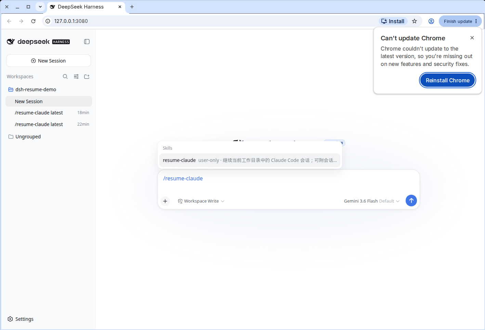
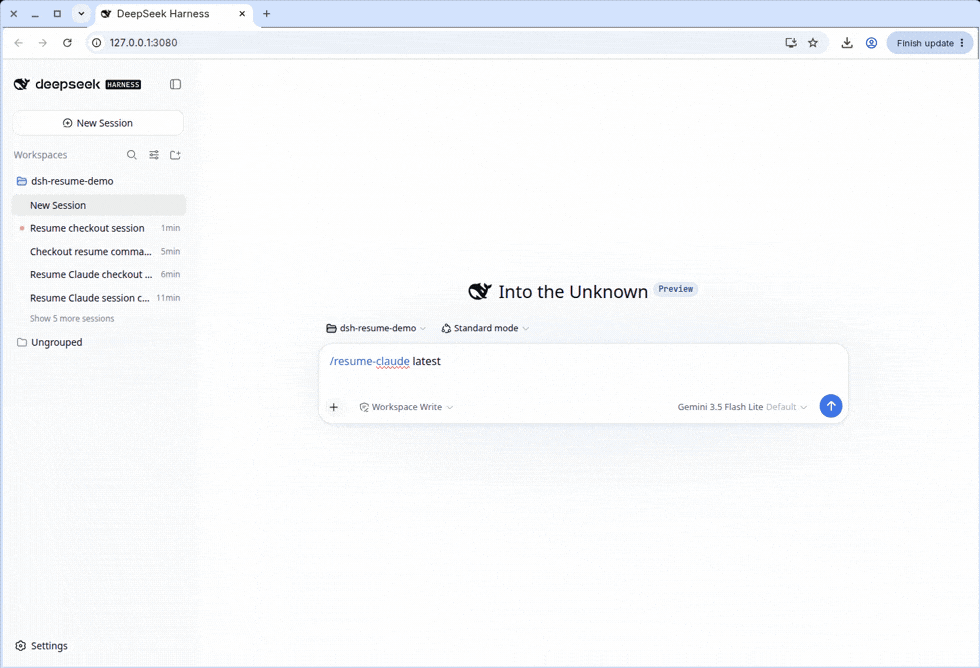
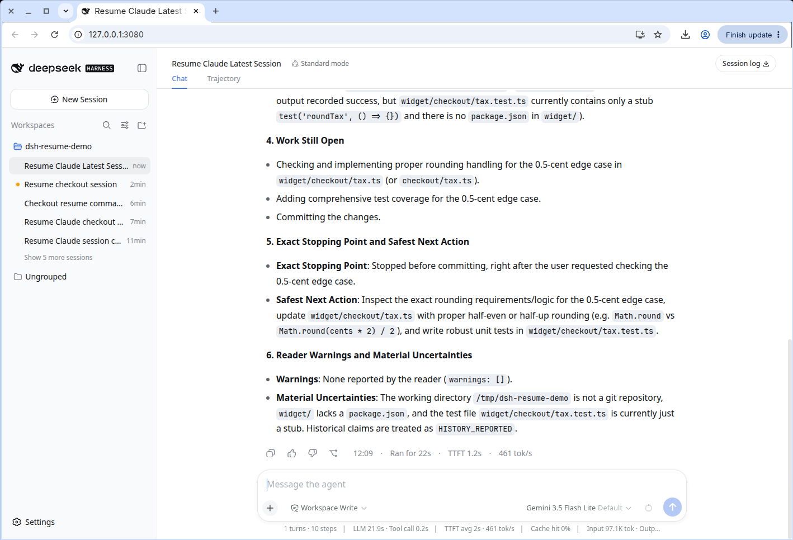
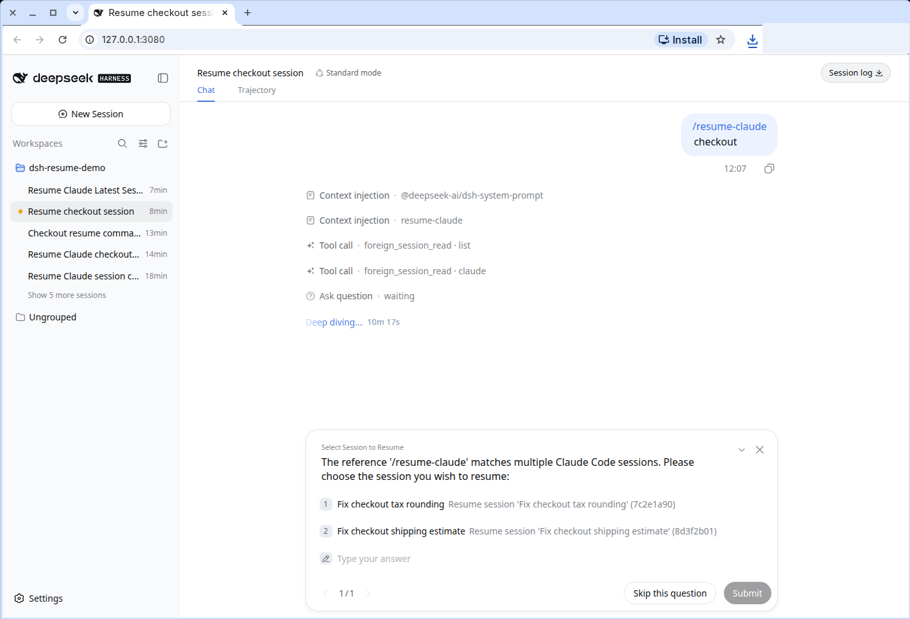

# dsh-resume

[English](README.en.md)

把 Codex、Claude Code、Cursor、Grok、Pi、ZCode 的本机会话整理成可继续工作的上下文，在 DeepSeek Harness 中接着做。

## 安装

**0.2.3 面向 DeepSeek Harness 0.1.7-rc.2 验证。** 安装包和仓库均包含编译好的插件，无需下载 Harness 源码或自行构建。读取历史需要本机有 Python 3；读取压缩的 Codex rollout 另需 `zstd`。

### 官方桌面端

1. 打开 **插件 → 添加插件**（部分版本入口在设置里）。
2. 在 **包名或地址** 中填入 `github:aa2246740/dsh-resume#v0.2.3`，然后安装并启用。
3. 按安装器提示完成激活，在输入框输入 `/resume-`，确认能看到下面列出的六条命令。

也可以在 [v0.2.3 Release](https://github.com/aa2246740/dsh-resume/releases/tag/v0.2.3) 下载 `dsh-resume-0.2.3.tgz`，把该文件的绝对路径填入同一安装框。桌面端使用自己的 desktop profile，无需运行 Web Host 命令。

### Web Host

使用官方 CLI：

```sh
dsh plugin --profile web add github:aa2246740/dsh-resume#v0.2.3
```

或在下载的安装包所在目录运行：

```sh
dsh plugin --profile web add ./dsh-resume-0.2.3.tgz
```

需要官方 `dsh` 和 pnpm 可用，Node.js 版本为 `^22.19.0` 或 `>=24.0.0`。使用与现有 Web Host 相同的 `DSH_HOME`；这条命令只安装到 Web profile，不会替桌面端安装。按官方安装器返回的提示完成激活；只有它要求重启时，再正常退出并重开原来的 Host，不要启动第二个 Host。

### 升级与卸载

升级时重复对应安装步骤即可。若从旧版手动挂载方式迁移，停用旧的重复挂载行，只保留包自带的 `dsh-resume` 实例。

桌面端通过插件管理器卸载。Web Host 使用：

```sh
dsh plugin --profile web remove dsh-resume
```

## 使用

输入 `/resume-claude`，另外五条同理。它只读本机那次会话，抽出还能接手的上下文，写成一张交接卡。旧进程不会被拉起来，别人的会话文件也不会被改。









六段按目标、文件、做到哪、还差什么、停在哪、读者警告来写。标题对不上号时不会猜，会列出候选让你挑。

## 命令

只读，不改任何一家的会话仓库。系统提示、隐藏推理、加密或坏掉的记录要么丢掉，要么标明不可用。历史里的结论先标成 `HISTORY_REPORTED`，这轮在当前仓库里核对过的才是 `CURRENT_OBSERVED`。Grok 只读看得见的 `updates.jsonl`。Pi 只跟当前这条分支。ZCode 只读 `cli/db/db.sqlite`，不回放调用、不复活进程。压缩只标成警告，库里仍在的更早记录会保留。废弃的 `v2/sessions` 和 `cli/rollout` JSONL 不是主存储；只有 sqlite 不在时，才对 `projects/` 下的 JSONL 做带警告的尽力读取。

| 命令 | 从哪接着 |
| --- | --- |
| `/resume-codex [latest \| 会话 id \| 路径 \| 标题]` | Codex CLI / 应用 |
| `/resume-claude [latest \| 会话 id \| 路径 \| 标题]` | Claude Code |
| `/resume-cursor [latest \| 会话 id \| 路径 \| 标题]` | Cursor |
| `/resume-grok [latest \| 会话 id \| 路径 \| 标题]` | Grok |
| `/resume-pi [latest \| 会话 id \| 路径 \| 标题]` | Pi |
| `/resume-zcode [latest \| 会话 id \| 路径 \| 标题]` | ZCode |

## 开发

```sh
corepack pnpm install
pnpm check
```

## 许可

Apache-2.0。见 [LICENSE](LICENSE) 和 [NOTICE](NOTICE)。
